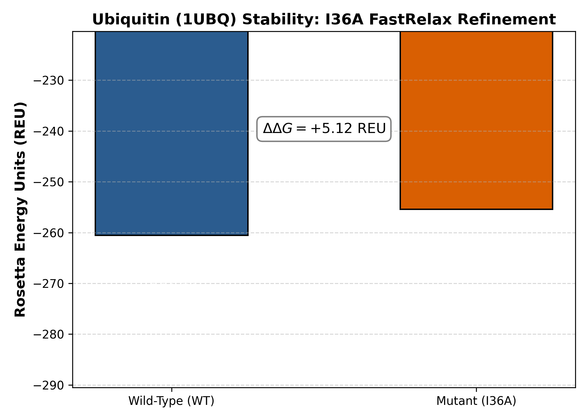

# Quantitative Stability & Structural Impact Analysis of Ubiquitin (I36A) via PyRosetta

[](https://www.pyrosetta.org/)
[](https://www.rcsb.org/structure/1UBQ)
[](https://www.python.org/)
[](https://opensource.org/licenses/MIT)

## Overview & Scientific Rationale

Ubiquitin is a highly conserved 76-amino acid regulatory protein essential for eukaryotic post-translational modification pathways. The native tertiary structure relies on a tightly packed hydrophobic core that stabilizes its characteristic $\beta$-grasp fold. 

This repository documents an *in silico* point-mutation analysis of I36A (Isoleucine to Alanine substitution at position 36) in human ubiquitin (PDB: 1UBQ), carried out using PyRosetta. Residue Ile36 is embedded within the hydrophobic core between the central $\alpha$-helix and the multi-stranded $\beta$-sheet. Truncating its bulky hydrophobic sidechain introduces local packing defects (cavity formation), causing structural perturbations and destabilizing the ground-state fold.

---

## Computational Methodology

The workflow utilizes the standard Rosetta all-atom energy function (ref2015) following structural preparation:

1. Structure Ingestion & Cleaning:
   - Raw coordinates imported from RCSB PDB entry 1UBQ (Vijay-Kumar et al., 1987).
   - Crystallographic waters, counter-ions, and non-protein heteroatoms removed to generate 1UBQ.clean.pdb.

2. Native Relaxation (WT):
   - The wild-type monomer was pre-equilibrated using Rosetta FastRelax to relieve minor steric clashes while tethering the backbone to native coordinates.

3. In Silico Mutagenesis & Packing:
   - Residue 36 was mutated from Isoleucine to Alanine (PackRotamersMover).
   - Surrounding residues within an 8.0 Å shell were repacked to optimize local hydrogen-bonding and Lennard-Jones contacts.

4. Iterative FastRelax Refinement:
   - Both the wild-type and the I36A mutant conformations underwent FastRelax protocols using ref2015 scoring.

5. Thermodynamic ($\Delta\Delta G$) & Conformational (RMSD) Evaluation:
   - Change in free energy was quantified as:
     $$\Delta\Delta G = E_{\text{mutant}} - E_{\text{WT}}$$
   - Global backbone ($C_\alpha$) and all-atom Root-Mean-Square Deviation (RMSD) metrics were calculated against the refined WT reference.

---

## Key Quantitative Findings

| Conformation / State | Total Energy (REU) | $\Delta\Delta G$ (REU) | Backbone $C_\alpha$ RMSD (Å) | All-Atom RMSD (Å) | Structural Interpretation |
| :--- | :---: | :---: | :---: | :---: | :--- |
| Wild-Type (WT FastRelax) | -260.50 | Reference (0.00) | — | — | Fully optimized native hydrophobic core |
| I36A Mutant FastRelax | -255.38 | +5.12 | 0.554 | 0.798 | Destabilized via core packing void; preserved fold |

### Energy Profile Visualization
The energetic discrepancy of +5.12 REU confirms that replacing the bulky $\beta$-branched isoleucine sidechain with a methyl group in alanine significantly disrupts internal van der Waals packing, leading to fold destabilization.



---

## Biophysical Discussion & Literature Validation

### 1. The Native Hydrophobic Architecture (Vijay-Kumar et al., 1987)
In the canonical 1.8 Å crystal structure of ubiquitin (PDB: 1UBQ), residue Ile36 is located at the transition between the core $\beta$-sheet and connecting loop elements. As established by Vijay-Kumar et al., ubiquitin features an exceptionally high degree of internal hydrogen bonding and dense hydrophobic packaging that gives the monomer remarkable intrinsic stability.
Substituting Ile36 removes three carbon centers from the hydrophobic pocket, which decreases favorable dispersion forces (van der Waals attractive terms) and lowers total packing density without unfolding the backbone (reflected by the modest $C_\alpha$ RMSD of 0.554 Å).

### 2. Core Cavity Dynamics & Conformational Selection (Michielssens et al., 2014)
The findings generated by our PyRosetta pipeline align with comprehensive molecular dynamics and biophysical investigations conducted by Michielssens et al. (2014). Their work demonstrated that hydrophobic core mutations—specifically I36A—shift ubiquitin's conformational ensemble away from its rigid ground state toward open/alternative substates, elevating baseline free energy and modulating binding affinity to downstream partners (such as the UBA domain of yeast Dsk2). Our calculated $\Delta\Delta G$ of +5.12 REU captures this thermodynamic penalty, reflecting the energetic destabilization caused by sidechain truncation.

---

## Repository Structure
```text
ubiquitin-pyrosetta-stability/
├── 1UBQ.pdb                           # Raw crystallographic coordinates from PDB
├── 1UBQ.clean.pdb                     # Cleaned monomer structure (no heteroatoms)
├── 1UBQ_WT_fastrelaxed.pdb            # Energy-minimized Wild-Type structure
├── 1UBQ_I36A_fastrelaxed.pdb          # Energy-minimized I36A mutant structure
├── ubiquitin_fastrelax_stability.png   # Comparative energy profile bar chart
├── ubiquitin_pyrosetta_analysis.ipynb # Complete PyRosetta analysis notebook
└── README.md                          # Scientific documentation & references
```

## Getting Started & Replication
Prerequisites
Python 3.10+
PyRosetta 4 (academic license required; via conda or wheel)
Standard scientific stack: numpy, pandas, matplotlib, seaborn
Executing the Analysis
Open the Jupyter notebook directly in your local environment or Google Colab:
jupyter notebook ubiquitin_pyrosetta_analysis.ipynb

---

## References

1. Vijay-Kumar, S., Bugg, C. E., & Cook, W. J. (1987). Structure of ubiquitin refined at 1.8 Å resolution. *Journal of Molecular Biology*, 194(3), 531–544.  
   DOI: [10.1016/0022-2836(87)90679-6](https://doi.org/10.1016/0022-2836(87)90679-6) | PDB: [1UBQ](https://www.rcsb.org/structure/1UBQ)

2. Michielssens, S., Peters, J. H., Ban, D., Pratihar, S., Seeliger, D., Sharma, M., Giller, K., Sabo, T. M., Becker, S., Lee, D., Griesinger, C., & de Groot, B. L. (2014). A designed conformational shift to control protein binding specificity. *Angewandte Chemie International Edition*, 53(39), 10367–10371.  
   DOI: [10.1002/anie.201403102](https://doi.org/10.1002/anie.201403102)

3. Alford, R. F. et al. (2017). The Rosetta all-atom energy function for macromolecular modeling and design. *Journal of Chemical Theory and Computation*, 13(6), 3031–3048.  
   DOI: [10.1021/acs.jctc.7b00125](https://doi.org/10.1021/acs.jctc.7b00125)

---

## Author & Project Attribution

- Researcher / Developer: Taban Tavanmand
- GitHub: [@tabantavanmand](https://github.com/tabantavanmand)
- Focus: Structural Bioinformatics, In Silico Mutagenesis & Computational Protein Biophysics
